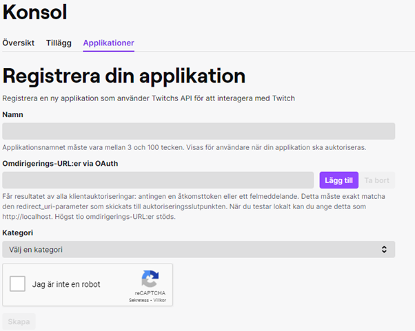
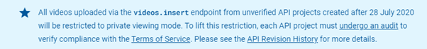

<h1>Automatically Upload Twitch Clips to Youtube</h1>
With this respiratory you can upload twitch clips from different categories directly to YouTube. I recommend reading through all the steps before trying to implement this program on your desirable device.

<h2>Step 1: Create twitch Developer Account and Fetch Videos, Data</h2>
Create an account on https://dev.twitch.tv/. After creating the account create an application in the console tab. In the application tab set the name as you want and set the redirect URL (OAuth) to "http://localhost". Also set the category to website integration.

After creating the credential file copy the ID and paste it in the twitch_credentials.py file.
The next part is choosing the different categories for the different videos to get. Note that YouTube only allows you to upload 6 videos a day, so set the max videos to 6. You can follow the documentation on https://dev.twitch.tv/docs/v5/reference/clips.

Here is an example:

https://api.twitch.tv/kraken/clips/top?game=League%20of%20Legends&period=day&trending=false&limit=6&language=en

<h2>Step 2: Google Credentials</h2>
The next step is to navigate to https://console.cloud.google.com/ and login in with your desirable google account. Create a new project in the upper left corner. After that navigate to APIs & Services, Credentials. After that create a new credential with the category “OAuth client ID”. The application type should be “Desktop app”. Then you can simply download the data to a json file.

<h2>Step 3: Annoying Google</h2>
Unfortunately, because google is paranoid to upload videos remotely we need to undergo an audit. I strongly recommend reading through the terms and services and the API Revision History. 

Audit link: https://support.google.com/youtube/contact/yt_api_form
Unfortunately, this is not as easy as it sounds. After sending in the audit, they contacted me for extra details, and I was forced to contact them via email 3-4 times before they would accept the application.

<h2>Step 4: Requirements</h2>

1. Make sure that the latest version of python is installed.

2. Run the following line in the terminal: pip install -r requirements.txt

<h2>Other Content</h2>
<h3>Trouble shooting links</h3>

* https://developers.google.com/youtube/v3/guides/uploading_a_video

* https://help.twitch.tv/s/article/basic-troubleshooting-tips?language=en_US

* https://developers.google.com/youtube/v3/docs/videos/insert

<h3>Disclaimer</h3>
When uploading videos to YouTube, make sure that you are both following twitch and YouTube guidelines and that you run it at your own risk.
